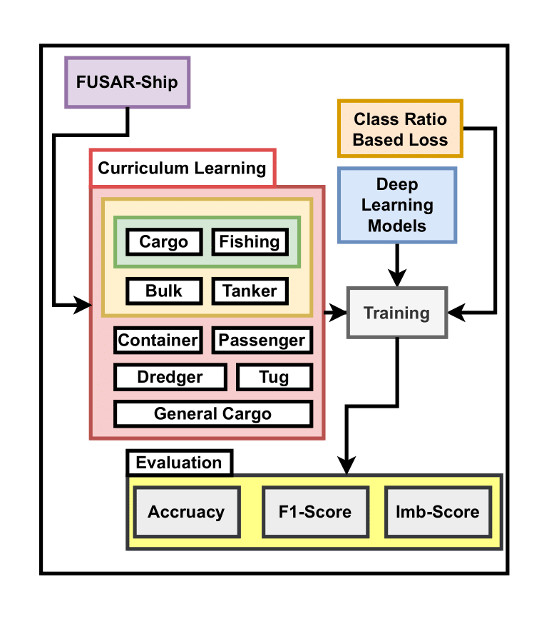

# A Framework for Imbalanced SAR Ship Classification: Curriculum Learning, Weighted Loss Functions, and a Novel Evaluation Metric

## Overview
This repository presents a comprehensive framework for addressing the challenges of imbalanced Synthetic Aperture Radar (SAR) ship classification. The framework incorporates **Curriculum Learning**, **Weighted Loss Functions**, and a **Novel Evaluation Metric** to improve model performance on imbalanced datasets. The codebase is modular and designed for easy experimentation and evaluation.

## Citation

If you use this repository in your work, please cite it as follows:

```bibtex
@inproceeding{N/A,
  author       = {Ch Muhammad Awais, Marco Reggiannini and Davide Moroni},
  title        = {A Framework for Imbalanced SAR Ship Classification: Curriculum Learning, Weighted Loss Functions, and a Novel Evaluation Metric},
  year         = 2025,
  version      = {1.0.0},
  doi          = {N/A},
  url          = {[https://github.com/username/repository-name](https://github.com/cm-awais/sar_curriculum_learning)}
}

---

## Key Features
1. **Curriculum Learning**:
   - Gradually introduces complex data to the model, starting with easier examples.
   - Implemented in `curriculum.ipynb` for dataset creation.

2. **Weighted Loss Functions**:
   - Adjusts class weights to handle imbalanced datasets.
   - Includes baseline and curriculum-based training with various weight initialization and update strategies.

3. **Novel Evaluation Metric**:
   - Introduces a custom evaluation metric to better assess model performance on imbalanced data.
   - Implemented in `evaluate.py`.

4. **Reproducibility**:
   - Ensures consistent results by setting random seeds for Python, NumPy, and PyTorch.
   - Disables CuDNN heuristics for deterministic behavior.

---

## Methodology

Below is a high-level overview of the methodology used in this framework:

  
*Figure 1: Overview of the proposed framework for imbalanced SAR ship classification.*

---

## Project Structure

### Files and Their Functions

#### 1. **`evaluate.py`**
   - Contains the **novel evaluation metric** and functions to assess model performance.
   - Computes metrics such as accuracy, precision, recall, and F1-score, tailored for imbalanced datasets.

#### 2. **`curriculum.ipynb`**
   - A Jupyter notebook for creating **curriculum datasets**.
   - Implements the curriculum learning strategy by organizing data from easy to hard examples.

#### 3. **`main.py`**
   - The main script to run the training and evaluation pipeline.
   - Imports functions from `utils.py` and `models.py`.
   - Sets random seeds and disables CuDNN heuristics for reproducibility.

#### 4. **`utils.py`**
   - Contains utility functions for data preprocessing, training loops, and other helper tasks.
   - Supports the main training and evaluation processes.

#### 5. **`models.py`**
   - Defines the machine learning models used in the project.
   - Includes model architectures and initialization logic.

---

## Training Functions

The following functions are implemented in `main.py` to train models using different techniques:

### Baseline Models
- **`baseline_norm()`**: Trains the baseline model without any weight intervention.
- **`curriculum_norm()`**: Trains the curriculum learning model without any weight intervention.

### Weighted Models
- **`train_baseline_weights()`**: Trains the baseline model with starting weights based on the class ratio.
- **`train_curriculum_weights()`**: Trains the curriculum learning model with starting weights based on the class ratio.

### Random Weight Assignment
- **`train_baseline_weightsU0()`**: Trains the baseline model with random weight assignment and updates the weights based on previous scores.
- **`train_curriculum_weightsU0()`**: Trains the curriculum learning model with random weight assignment and updates the weights based on previous scores.

### Weight Update After 5 Epochs
- **`train_baseline_weightsU()`**: Trains the baseline model with starting weights based on the class ratio and updates the weights after 5 epochs.
- **`train_curriculum_weightsU()`**: Trains the curriculum learning model with starting weights based on the class ratio and updates the weights after 5 epochs.

---

## Reproducibility
To ensure consistent results, the code sets random seeds for Python, NumPy, and PyTorch, and disables CuDNN heuristics:

```python
random.seed(42)
np.random.seed(42)
torch.manual_seed(42)
torch.cuda.manual_seed(42)
torch.cuda.manual_seed_all(42)  # for multi-GPU setups
cudnn.benchmark = False
```

---

## Usage

### 1. **Data Preparation**
   - Use `curriculum.ipynb` to create curriculum datasets for training.

### 2. **Training Models**
   - Run `main.py` to train models using the various techniques described above.

### 3. **Evaluation**
   - Use the evaluation function in `evaluate.py` to assess model performance using the novel metric.

---

## Dependencies
The project relies on the following Python libraries:

```python
import os
import torch
import torchvision
import torchvision.transforms as transforms
import torch.nn as nn
import torch.optim as optim
from torch.utils.data import DataLoader, Dataset, random_split
from torchvision.datasets import ImageFolder
from PIL import Image
import numpy as np
import copy
from sklearn.metrics import confusion_matrix, accuracy_score, precision_score, recall_score, f1_score
import multiprocessing as mp
from torchvision import models
from copy import deepcopy
import warnings
import csv
import torchvision.transforms as transforms
import timm
import random
import torch.backends.cudnn as cudnn
from sklearn.metrics import classification_report
import json
from m_models import *
import os
import pandas as pd

import os
import shutil
from collections import defaultdict
from sklearn.model_selection import train_test_split
from torchvision import datasets, transforms
from torch.utils.data import DataLoader
import random
```

Install the dependencies using pip:
```bash
pip install numpy torch torchvision scikit-learn timm pandas
```

---

## Notes
- **Warnings**: Warnings are suppressed using `warnings.filterwarnings('ignore')` to keep the output clean.
- **Customization**: Modify the functions in `utils.py` and `models.py` to adapt the code to your specific needs.

---

## Conclusion
This framework provides a robust solution for imbalanced SAR ship classification by combining curriculum learning, weighted loss functions, and a novel evaluation metric. It is designed for easy experimentation and can be adapted to other imbalanced classification tasks.

Happy coding! 🚀
